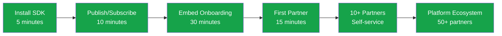

## What is EnSync?

EnSync is partner integration infrastructure for B2B platforms. We enable self-service partner onboarding and bidirectional event delivery through persistent connections, so your partners can integrate in minutes instead of weeks.

Whether you're building a new product that needs to be integration-ready from day one, or scaling an existing platform to 100+ partners, EnSync provides the infrastructure to make partner integration seamless.

<Note>
**Messaging, Not Broadcasting**: EnSync works like messaging, not broadcasting. When you publish an event, you specify which partners should receive it—just like sending a WhatsApp message to specific contacts. Even if multiple partners subscribe to the same event type, they only receive events explicitly addressed to them. This ensures multi-tenant data isolation and privacy.
</Note>

## Why We're Building EnSync

We're building EnSync because partner integration shouldn't be a bottleneck to growth.

We believe products should be built integration-ready from the start. Whether you're launching your first partner integration or scaling to your hundredth, the infrastructure should be the same. We're creating the tools that let you build once and scale infinitely.

We're solving for:
- **New products** that want to be integration-ready from day one
- **Growing platforms** scaling from 10 to 100+ partners
- **Engineering teams** spending 30%+ time on partner support
- **Manual onboarding** taking 2-4 weeks per partner

## Who EnSync is For

EnSync is built for B2B platforms that need partner integrations—whether you're just starting or ready to scale.

### Business Value
- **Product Offerings** - Enhance existing products with real-time capabilities
- **New Business Models** - Enable innovative service offerings through integration
- **Reduced Development Time** - Standardized integration patterns accelerate development
- **Operational Visibility** - Gain insights across your entire ecosystem
- **Scalable Architecture** - Grow your integration capabilities alongside your business
- **Reliable Delivery** - Ensure critical business events are never lost

### Common Use Cases

- **Logistics & Delivery** - Carrier integrations, real-time tracking
- **E-Commerce & Marketplaces** - Merchant and supplier connections
- **Payroll & Fintech** - Bank integrations, payment confirmations
- **Supply Chain & Manufacturing** - Multi-party workflows
- **IoT & Connected Devices** - Device-to-platform communication

## Core Features

<CardGroup cols={2}>
  <Card title="Event-Driven Architecture" icon="bolt">
    Real-time event delivery with ordered, guaranteed delivery semantics
  </Card>
  <Card title="Data Synchronization" icon="arrows-rotate">
    Keep up with data changes on partner systems in real-time
  </Card>
  <Card title="Self-Service Onboarding" icon="rocket">
    Partners onboard themselves in 15 minutes via embedded iframe
  </Card>
  <Card title="Structured Event Schema" icon="file-code">
    Define flexible event structures with optional schema validation
  </Card>
  <Card title="E2E Message Encryption" icon="lock">
    End-to-end encryption for all messages between you and partners
  </Card>
  <Card title="90-Day Event Retention" icon="clock-rotate-left">
    Replay events for debugging and reconciliation
  </Card>
  <Card title="Granular Access Control" icon="shield-check">
    Path-based permissions for event types
  </Card>
  <Card title="Firewall-Friendly Transport" icon="network-wired">
    gRPC for performance, WebSocket fallback for restrictive firewalls
  </Card>
</CardGroup>

## From Integration to Platform

**Result**: ~1 hour initial setup + self-service onboarding = **0 hours per partner**

